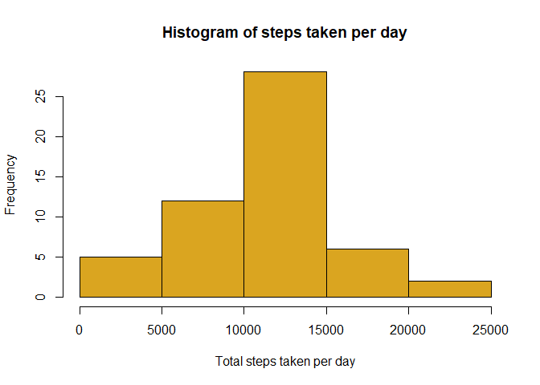
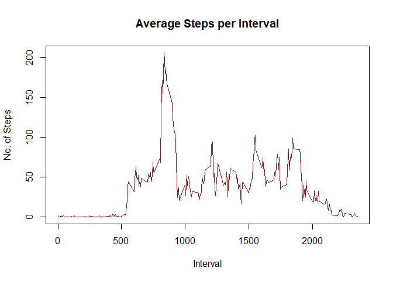
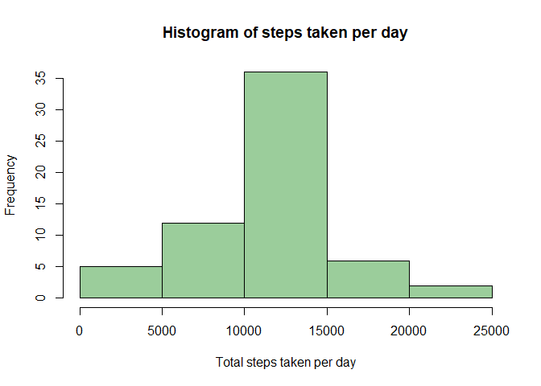
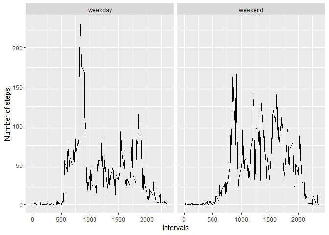

## Course Project 1
### Reading and Preprocessing
Reading and preprocessing the data is the first step. The file is read into a dataframe called 'activity'. Subsequently, dataframes act1 and act2 were made, containing omitted missing values and imputed missing values respectively. act2 will be made later.


```r
activity<-read.csv('activity.csv')
act1<-na.omit(activity)
```
### The Histogram, Mean and Median
The step data was aggregated by date using sum as the function to obtain the total number of steps taken per day. The histogram, mean and median were done on the act1 dataframe.


```r
total1<-aggregate(act1$steps, by = list(act1$date), FUN = sum)
hist(total1$x, xlab = "Total steps taken per day",
      main = "Histogram of steps taken per day", col = "goldenrod")
```

<!-- -->

```r
mean(total1$x)
```

```
## [1] 10766.19
```

```r
median(total1$x)
```

```
## [1] 10765
```

### Average Daily Activity Pattern
The steps were again aggregated but this time using the function mean and the interval column. Each interval occurs once each day. The time series plot was built on this aggregation. 

```r
average<-aggregate(act1$steps, by = list(act1$interval), FUN = mean)
plot(average$Group.1,average$x, type = 'l', xlab = 'Interval', ylab = 'No. of Steps',
     main = 'Average Steps per Interval', col = 'firebrick4')
```

<!-- -->

The interval with the maximum number of steps can be obtained using the following code chunk.

```r
subset(average, x==max(average$x))
```

```
##     Group.1        x
## 104     835 206.1698
```
It is inferred that the interval *08:35 - 08:40 AM* has the maximum average number of steps, which is *206.1698*.

### Working with imputed missing values
act2 is a copy of the activity dataframe whose missing values are imputed using the mean steps for the interval pertaining to the missing value. The dplyr package was used to allow this.

```r
library(dplyr)
```

```
## Warning: package 'dplyr' was built under R version 4.0.5
```

```
## 
## Attaching package: 'dplyr'
```

```
## The following objects are masked from 'package:stats':
## 
##     filter, lag
```

```
## The following objects are masked from 'package:base':
## 
##     intersect, setdiff, setequal, union
```

```r
act2<-activity
act2<-act2 %>% group_by(interval) %>% mutate(steps = ifelse(is.na(steps), mean(steps,na.rm=TRUE), steps))
head(act2)
```

```
## # A tibble: 6 x 3
## # Groups:   interval [6]
##    steps date       interval
##    <dbl> <chr>         <int>
## 1 1.72   2012-10-01        0
## 2 0.340  2012-10-01        5
## 3 0.132  2012-10-01       10
## 4 0.151  2012-10-01       15
## 5 0.0755 2012-10-01       20
## 6 2.09   2012-10-01       25
```
The step data was aggregated by date using sum as the function to obtain the total number of steps taken per day. The histogram, mean and median were done on the act2 dataframe this time.


```r
total2<-aggregate(act2$steps, by = list(act2$date), FUN = sum)
hist(total2$x, xlab = "Total steps taken per day",
      main = "Histogram of steps taken per day", col = "darkseagreen3")
```

<!-- -->

```r
mean(total2$x)
```

```
## [1] 10766.19
```

```r
median(total2$x)
```

```
## [1] 10766.19
```
The mean number of steps taken per day when missing values were omitted was 10766.19 which is the same in this case. The median is also 10766.19, though it was 10765 previously.

### Weekdays vs Weekends
The weekdays() function got the day of the week for each date of the dataframe act2. Vectors were used to classify the days of the week into weekdays or weekends.The average steps were taken per interval based on weekdays/weekends. qplot from the ggplot2 library was used to plot the data, with two panels for weekdays and weekends

```r
weekdays<-c("Monday", "Tuesday", "Wednesday", "Thursday", "Friday")
weekends<-c("Saturday", "Sunday")

colnames(total2)<-c("date","steps")
act2$date<-as.Date(act2$date)
act2$weekdays<-weekdays(act2$date)
act2$weekdays<-replace(act2$weekdays,act2$weekdays %in% weekdays, "weekday")
act2$weekdays<-replace(act2$weekdays,act2$weekdays %in% weekends, "weekend")

library(ggplot2)
average2<-aggregate(act2$steps, by = list(act2$weekdays,act2$interval), FUN = mean)
colnames(average2)<-c("weekdays","interval","steps")
qplot(interval,steps,data = average2,facets = ~weekdays, geom = "line", xlab = "Intervals",
      ylab = "Number of steps")
```

<!-- -->

This dataframe was used to construct the panel plot for average steps per time interval on weekdays vs weekends. qplot from ggplot2 was used. 
